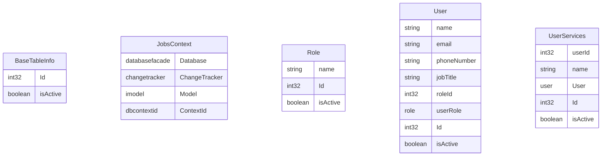

```mermaid
erDiagram
    BaseTableInfo {
        int32 Id
        boolean isActive
    }
    JobsContext {
        databasefacade Database
        changetracker ChangeTracker
        imodel Model
        dbcontextid ContextId
    }
    Role {
        string name
        int32 Id
        boolean isActive
    }
    User {
        string name
        string email
        string phoneNumber
        string jobTitle
        int32 roleId
        role userRole
        int32 Id
        boolean isActive
    }
    UserServices {
        int32 userId
        string name
        user User
        int32 Id
        boolean isActive
    }

```
